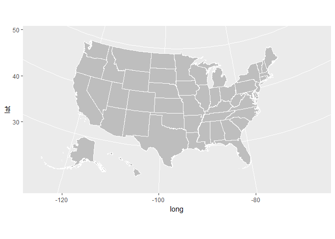
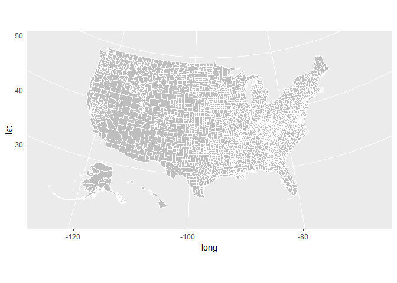
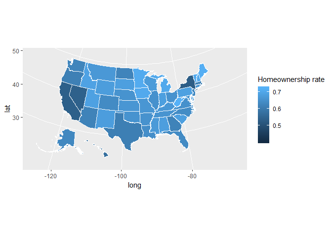
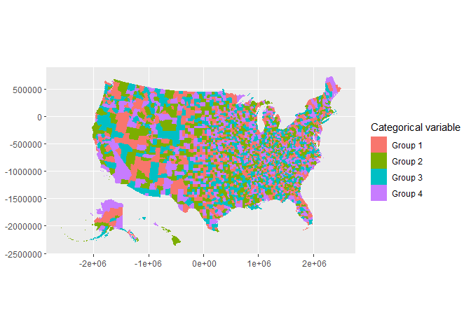
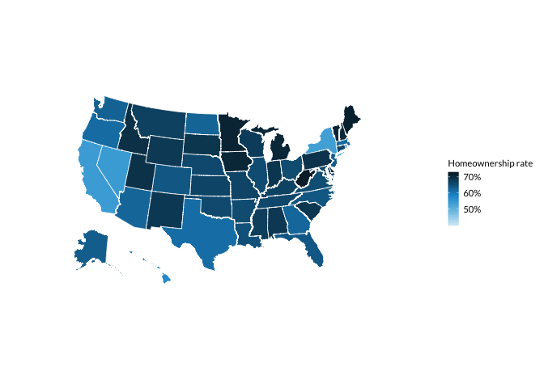
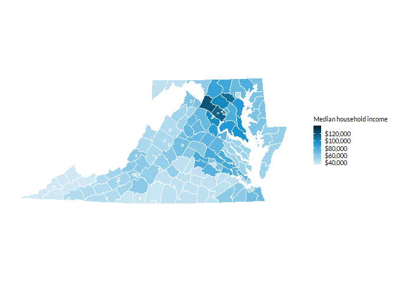

<!-- README.md is generated from README.Rmd. Please edit that file -->
urbnmaps
========

[](https://travis-ci.org/UrbanInstitute/urbnmaps)

The `urbnmapr` package provides state and county shapefiles in `tibble` format that is compatible to map with `ggplot2`.

Shapefiles include Alaska and Hawaii, transformed to be displayed as insets within the continental United States.

This package is heavily inspired by and derived in part from the [fiftystater package](https://cran.r-project.org/package=fiftystater) by William Murphy. In contrast, `urbnmapr`:

-   Uses shapefiles from the US Census Bureau
-   Converts the shapefile data to a `tibble` dataframe
-   Adds various identifiers for merging
-   Includes a county-level shapefile

Installation
------------

You can install the latest version of `urbnmapr` from GitHub:

``` r
# install.packages(devtools)
devtools::install_github("UrbanInstitute/urbnmapr")
```

Usage
-----

`urbnmapr` contains two `tibble` dataframes:

-   `states`
-   `counties`

The `states` and `counties` tibbles can be used with `geom_polygon()` and `coord_map()` to create base maps of the continental United States, with Alaska and Hawaii displayed as insets:

``` r
library(tidyverse)
library(urbnmapr)

states %>%
  ggplot(aes(long, lat, group = group)) +
    geom_polygon(fill = "grey", color = "#ffffff", size = 0.25) +
    coord_map(projection = "albers", lat0 = 39, lat1 = 45)
```



``` r
counties %>%
  ggplot(aes(long, lat, group = group)) +
    geom_polygon(fill = "grey", color = "#ffffff", size = 0.05) +
    coord_map(projection = "albers", lat0 = 39, lat1 = 45)
```



Merging Data
------------

The `states` and `counties` tibbles include various identifiers to simplify merging data. The states `states` tibble contains `state_fips`, `state_abbv`, and `state_name`. The `counties` tibble contains `county_fips`, `state_abbv`, `state_fips`, `county_name`, and `state_name`. Both tibbles can be piped into `ggplot2` to create a choropleth map.

``` r
USArrests %>%
  rownames_to_column("state_name") %>%
  select(state_name, Murder) %>%
  left_join(states, by = "state_name") %>%
  ggplot(aes(long, lat, group = group, fill = Murder)) +
    geom_polygon(color = "#ffffff", size = 0.25) +
    coord_map(projection = "albers", lat0 = 39, lat1 = 45)
```



``` r
household_data <- left_join(countydata, counties, by = "county_fips") 

household_data %>%
  ggplot(aes(long, lat, group = group, fill = medhhincome)) +
    geom_polygon(color = "#ffffff", size = 0.05) +
    coord_map(projection = "albers", lat0 = 39, lat1 = 45)
```



Styles
------

`library(urbnmapr)` works well with the [Urban Institute `ggplot2` theme.](https://github.com/UrbanInstitute/urban_R_theme)

``` r
source("https://raw.githubusercontent.com/UrbanInstitute/urban_R_theme/urban_R_theme_revamp/urban_theme.R")
```

``` r
USArrests %>%
  rownames_to_column("state_name") %>%
  select(state_name, Murder) %>%
  left_join(states, by = "state_name") %>%
  ggplot(aes(long, lat, group = group, fill = Murder)) +
    geom_polygon(color = "#ffffff", size = 0.25) +
    coord_map(projection = "albers", lat0 = 39, lat1 = 45) +
    scale_fill_gradientn() +
    urban_map +
    theme(legend.position = "right",
          legend.direction = "vertical",
          legend.title = element_text(face = "bold", size = 11))
```



``` r
household_data %>%
  filter(state_name %in% c("Virginia", "Maryland", "District of Columbia")) %>%
  ggplot(aes(long, lat, group = group, fill = medhhincome)) +
    geom_polygon(color = "#ffffff", size = 0.05) +
    coord_map(projection = "albers", lat0 = 39, lat1 = 45) +
    scale_fill_gradientn(labels = scales::dollar) +
    urban_map +
    theme(legend.position = "right",
          legend.direction = "vertical",
          legend.title = element_text(face = "bold", size = 11))
```



License
-------

Code released under the GNU General Public License v3.0.
