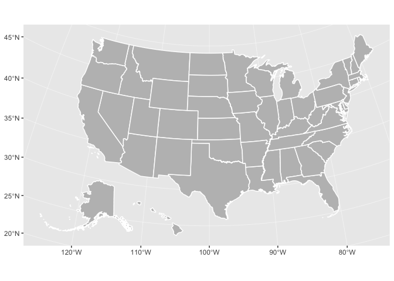
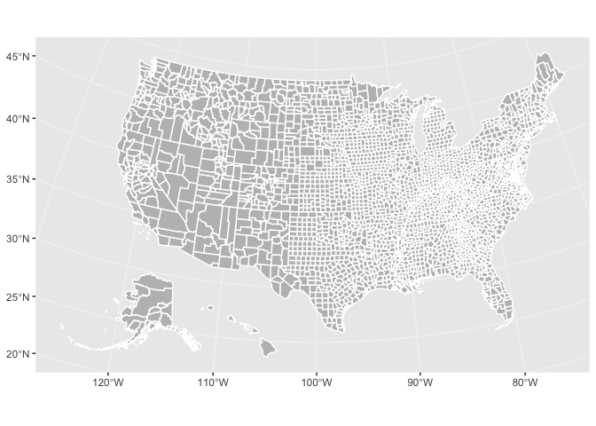
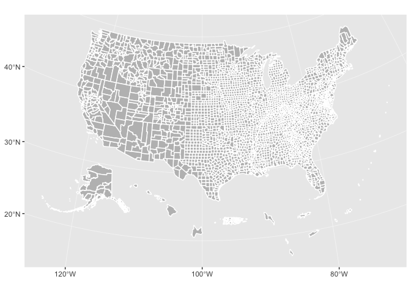
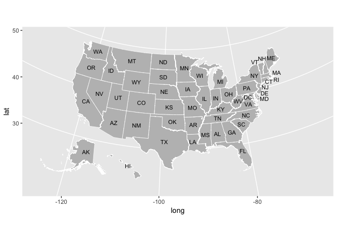

<!-- README.md is generated from README.Rmd. Please edit that file -->
urbnmapr 
=====================================================================================================

[](https://travis-ci.org/UrbanInstitute/urbnmapr)

The `urbnmapr` package provides state and county shapefiles that are compatible to map with `ggplot2`.

Shapefiles include Alaska and Hawaii, transformed to be displayed as insets within the continental United States. There are options to include the territories for both the state and county maps.

This package is heavily inspired by and derived in part from the [fiftystater package](https://cran.r-project.org/package=fiftystater) by William Murphy. In contrast, `urbnmapr`:

-   Uses shapefiles from the US Census Bureau
-   Converts the shapefile data to `sf` format
-   Adds various identifiers for merging
-   Includes a county-level shapefile and options to add territories

Installation
------------

You can install the latest version of `urbnmapr` from GitHub:

``` r
# install.packages("devtools")
devtools::install_github("UrbanInstitute/urbnmapr")
```

Usage
-----

### Quick maps

The `get_urbn_map()` function can be used to call shapefiles. Using the `sf = TRUE` option will load `sf` objects. These can be used with `geom_sf()` to create base maps of the continental United States, with Alaska and Hawaii displayed as insets:

``` r
library(tidyverse)
library(urbnmapr)

states_sf <- get_urbn_map("states", sf = TRUE)

states_sf %>% 
  ggplot(aes()) +
  geom_sf(fill = "grey", color = "#ffffff")
```



``` r
library(tidyverse)
library(urbnmapr)

counties_sf <- get_urbn_map("counties", sf = TRUE)

counties_sf %>% 
  ggplot(aes()) +
  geom_sf(fill = "grey", color = "#ffffff")
```



The default projection is US National Atlas Equal Area.

### More maps

Maps with US territories can also be called with `get_urbn_map()`.

``` r
territories_counties <- get_urbn_map(map = "territories_counties", sf = TRUE)

ggplot() +
  geom_sf(territories_counties,
          mapping = aes(),
          fill = "grey", color = "#ffffff")
```



### Labels

Labels for all maps can be accessed with `get_urbn_labels()`. Only state labels are custom, so they can be displayed next to smaller states. Use the function to call the appropriate labels and then label the map with `geom_text()`. Labels can be called inside of `geom_text()`:

``` r
states_sf <- get_urbn_map(map = "states", sf = TRUE)

states_sf %>%
  ggplot() +
  geom_sf(aes(), 
          fill = "grey", color = "#ffffff", size = 0.25) +
  geom_sf_text(data = get_urbn_labels(map = "states", sf = TRUE), 
                aes(label = state_abbv), 
            size = 3)
```



Merging Data
------------

The states and counties spatial data include various identifiers to simplify merging data. The states `states` tibble contains `state_fips`, `state_abbv`, and `state_name`. The `counties` tibble contains `county_fips`, `state_abbv`, `state_fips`, `county_name`, and `state_name`.

``` r
spatial_data <- left_join(statedata,
                          get_urbn_map(map = "states", sf = TRUE),
                          by = "state_name")

ggplot() +
  geom_sf(spatial_data,
          mapping = aes(fill = horate),
          color = "#ffffff", size = .25) +
  labs(fill = "Homeownership rate")
```


``` r
counties_sf <- get_urbn_map(map = "counties", sf = TRUE)
household_data <- left_join(countydata, counties_sf, by = "county_fips")

household_data %>%
  ggplot() +
  geom_sf(mapping = aes(fill = medhhincome),
          color = NA, size = 0.05)
```


Styles
------

`library(urbnmapr)` works well with the [Urban Institute `ggplot2` theme.](https://github.com/UrbanInstitute/urban_R_theme)

``` r
library(urbnthemes)

set_urbn_defaults(style = "map")
```

``` r
states_sf <- get_urbn_map(map = "states", sf = TRUE)

statedata %>% 
  left_join(states_sf, by = "state_name") %>% 
  ggplot() +
  geom_sf(mapping = aes(fill = horate),
          color = "#ffffff", size = .25) +
  scale_fill_gradientn(labels = scales::percent) +
  labs(fill = "Homeownership rate") +
  coord_sf(datum = NA)
```


Map smaller geographies with `filter()`. You may need to reproject the data based on which areas you are mapping.

``` r
dmv <- household_data %>% 
  sf::st_as_sf() %>% 
  sf::st_transform(crs = 4326)

dmv %>%
  filter(state_name %in% c("Virginia", "Maryland", "District of Columbia")) %>%
  ggplot() +
    geom_sf(mapping = aes(fill = medhhincome),
                 color = "#ffffff", size = 0.05) +
    coord_sf(crs = 4326, datum = NA) +
    scale_fill_gradientn(labels = scales::dollar) +
  labs(fill = "Median household income")
```


License
-------

Code released under the GNU General Public License v3.0.

Code of conduct
---------------

Please note that this project is released with a [Contributor Code of Conduct](CODE_OF_CONDUCT.md). By participating in this project you agree to abide by its terms.
