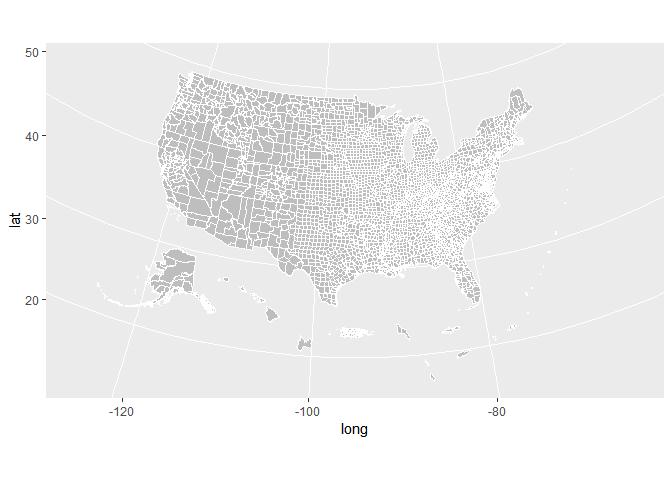
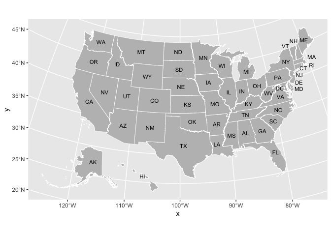
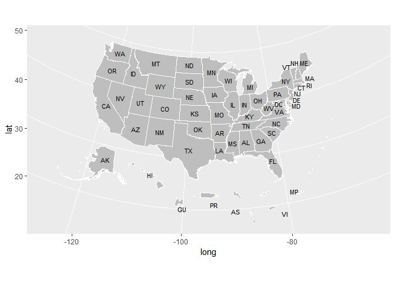
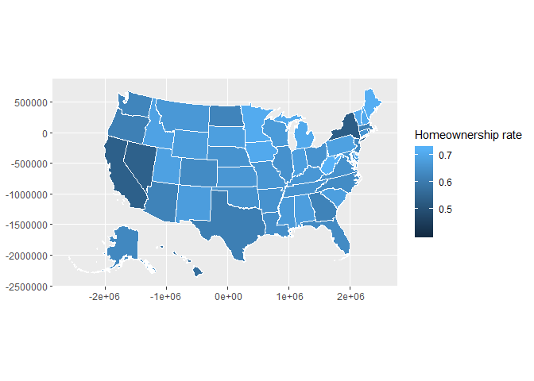
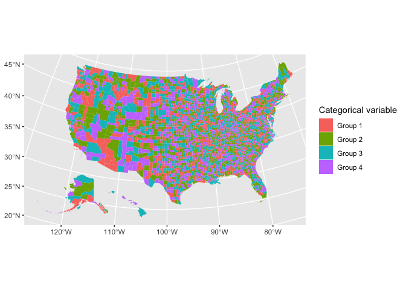
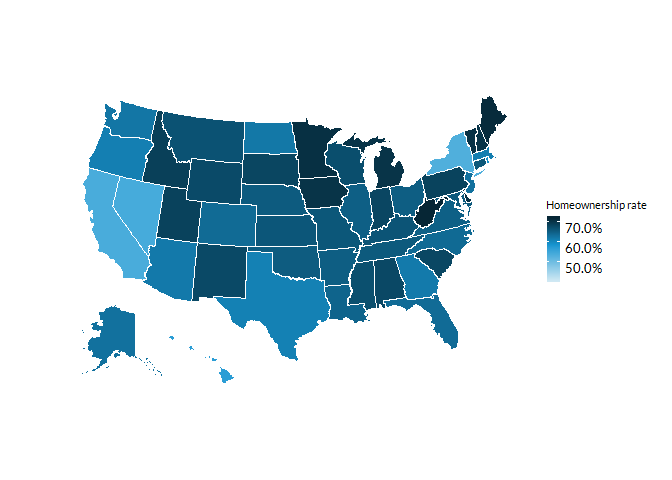
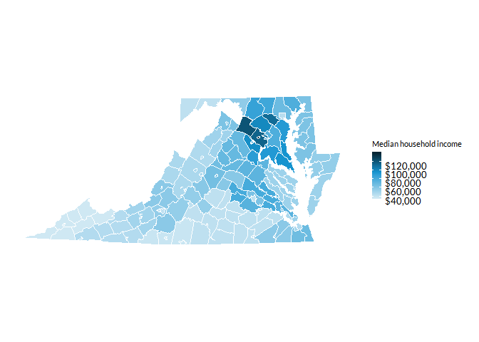

<!-- README.md is generated from README.Rmd. Please edit that file -->

# urbnmapr <a href="https://urbaninstitute.github.io/urbnmapr/"></a>

[](https://travis-ci.org/UrbanInstitute/urbnmapr)

The `urbnmapr` package provides state and county shapefiles in `tibble`
format that is compatible to map with `ggplot2`.

Shapefiles include Alaska and Hawaii, transformed to be displayed as
insets within the continental United States.

This package is heavily inspired by and derived in part from the
[fiftystater package](https://cran.r-project.org/package=fiftystater) by
William Murphy. In contrast, `urbnmapr`:

  - Uses shapefiles from the US Census Bureau
  - Converts the shapefile data to a `tibble` dataframe
  - Adds various identifiers for merging
  - Includes a county-level shapefile

## Stay up-to-date

Sign up
[here](https://app.smartsheet.com/b/form/9029a0a8254e4044a52cdebaebe343bf)
to stay up-to-date with R package releases and R resources from the
Urban Institute. We will not share your information and we will not
email more than once per month.

## Installation

You can install the latest version of `urbnmapr` from GitHub:

``` r
# install.packages("devtools")
devtools::install_github("UrbanInstitute/urbnmapr")
```

## Usage

### Quick maps

`urbnmapr` contains two `tibble` dataframes for creating maps:

  - `states`
  - `counties`

The `states` and `counties` tibbles can be used with `geom_polygon()`
and `coord_map()` to create base maps of the continental United States,
with Alaska and Hawaii displayed as insets:

``` r
library(tidyverse)
library(urbnmapr)

states %>%
  ggplot(aes(long, lat, group = group)) +
  geom_polygon(fill = "grey", color = "#ffffff", size = 0.25) +
  coord_map(projection = "albers", lat0 = 39, lat1 = 45)
```

<!-- -->

``` r
counties %>%
  ggplot(aes(long, lat, group = group)) +
  geom_polygon(fill = "grey", color = "#ffffff", size = 0.05) +
  coord_map(projection = "albers", lat0 = 39, lat1 = 45)
```

<!-- -->

### More maps

Additional maps can be accessed with `get_urbn_map()`. Use the function
to create a tibble in your global environment and then map using the
same syntax as above.

``` r
territories_counties <- get_urbn_map(map = "territories_counties")

territories_counties %>%
  ggplot(aes(long, lat, group = group)) +
  geom_polygon(fill = "grey", color = "#ffffff", size = 0.05) +
  coord_map(projection = "albers", lat0 = 39, lat1 = 45)
```

<!-- -->

### Labels

Labels for all maps can be accessed with `get_urbn_labels()`. Use the
function to call the appropriate labels and then label the map with
`geom_text()`. Labels can be called inside of `geom_text()`:

``` r
states %>%
  ggplot() +
  geom_polygon(aes(long, lat, group = group), 
               fill = "grey", color = "#ffffff", size = 0.25) +
  coord_map(projection = "albers", lat0 = 39, lat1 = 45) +
  geom_text(data = get_urbn_labels(map = "states"), aes(x = long, lat, label = state_abbv), 
            size = 3)
```

<!-- -->

Or before `geom_text()` is called:

``` r
territories <- get_urbn_map(map = "territories")
labels <- get_urbn_labels(map = "territories")

territories %>%
  ggplot() +
  geom_polygon(aes(long, lat, group = group),
               fill = "grey", color = "#ffffff", size = 0.05) +
  coord_map(projection = "albers", lat0 = 39, lat1 = 45) +
  geom_text(data = labels, aes(x = long, lat, label = state_abbv), size = 3) 
```

<!-- -->

## Merging Data

The `states` and `counties` tibbles include various identifiers to
simplify merging data. The states `states` tibble contains `state_fips`,
`state_abbv`, and `state_name`. The `counties` tibble contains
`county_fips`, `state_abbv`, `state_fips`, `county_name`, and
`state_name`. Both tibbles can be piped into `ggplot2` to create a
choropleth map.

``` r
statedata %>% 
  left_join(states, by = "state_name") %>% 
  ggplot(mapping = aes(long, lat, group = group, fill = horate)) +
  geom_polygon(color = "#ffffff", size = .25) +
  coord_map(projection = "albers", lat0 = 39, lat1 = 45) +
  labs(fill = "Homeownership rate")
```

<!-- -->

``` r
household_data <- left_join(countydata, counties, by = "county_fips") 

household_data %>%
  ggplot(aes(long, lat, group = group, fill = medhhincome)) +
    geom_polygon(color = "#ffffff", size = 0.05) +
    coord_map(projection = "albers", lat0 = 39, lat1 = 45)
```

<!-- -->

## Styles

`library(urbnmapr)` works well with the [Urban Institute `ggplot2`
theme.](https://github.com/UrbanInstitute/urban_R_theme)

``` r
library(urbnthemes)

set_urbn_defaults(style = "map")
```

``` r
statedata %>% 
  left_join(states, by = "state_name") %>% 
  ggplot(mapping = aes(long, lat, group = group, fill = horate)) +
  geom_polygon(color = "#ffffff", size = .25) +
  coord_map(projection = "albers", lat0 = 39, lat1 = 45) +
  scale_fill_gradientn(labels = scales::percent) +
  labs(fill = "Homeownership rate")
```

<!-- -->

``` r
household_data %>%
  filter(state_name %in% c("Virginia", "Maryland", "District of Columbia")) %>%
  ggplot(aes(long, lat, group = group, fill = medhhincome)) +
    geom_polygon(color = "#ffffff", size = 0.05) +
    coord_map(projection = "albers", lat0 = 39, lat1 = 45) +
    scale_fill_gradientn(labels = scales::dollar) +
  labs(fill = "Median household income")
```

<!-- -->

## License

Code released under the GNU General Public License v3.0.

## Code of conduct

Please note that this project is released with a [Contributor Code of
Conduct](CODE_OF_CONDUCT.md). By participating in this project you agree
to abide by its terms.
